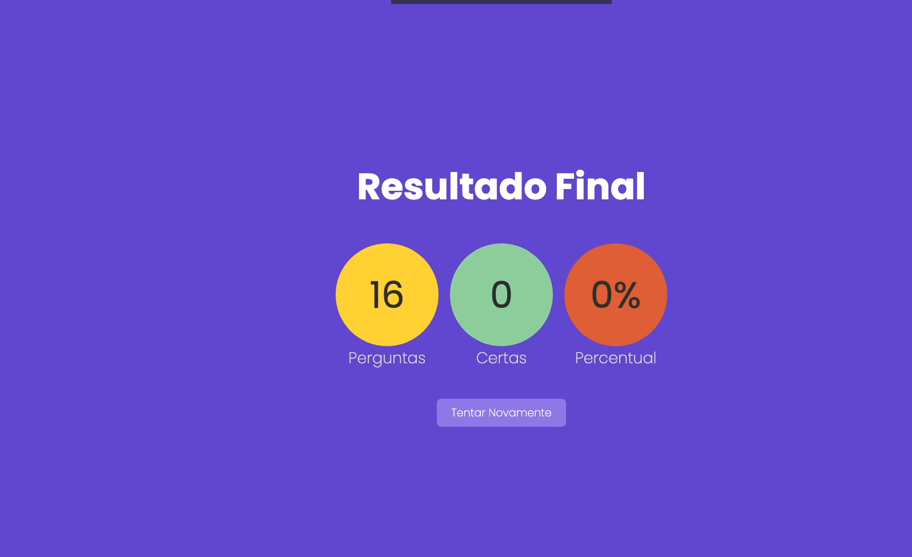
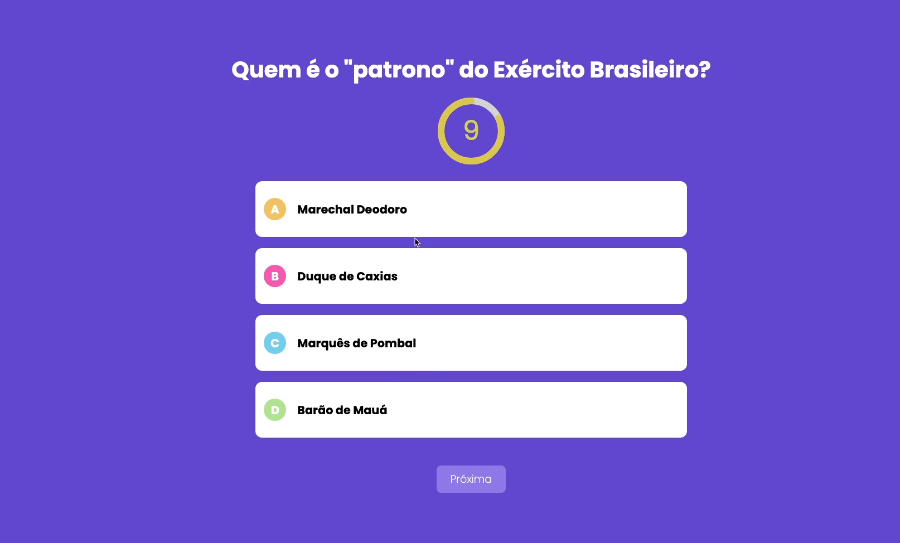
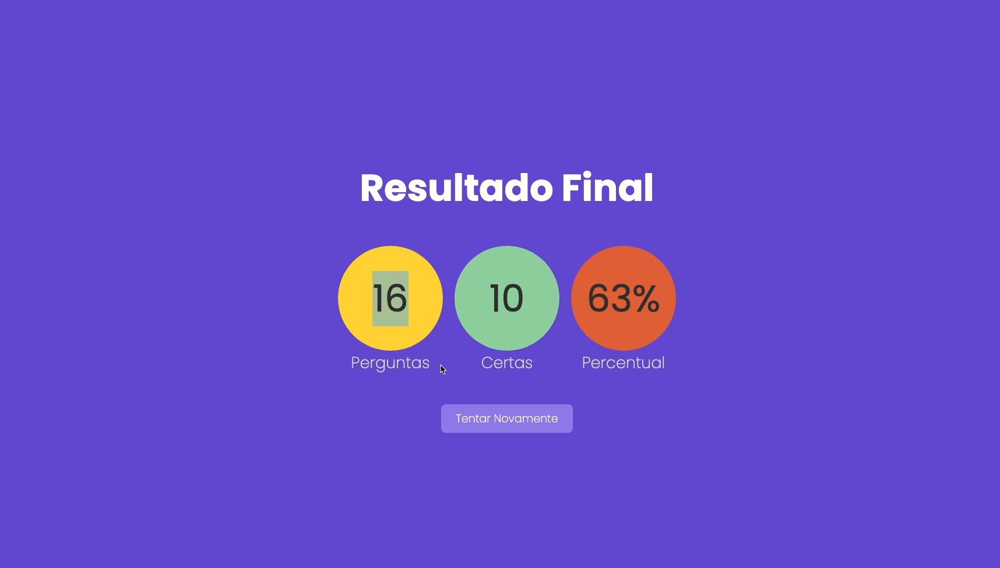

### Criando projeto

#### Page 1


#### Page 2


#### Page 3


#### Rodas para testes
* 1. Questões
```
http://localhost:3000/api/questoes/307
```

* 2. 
```
http://localhost:3000/api/questionario
```


* Link do treinamento. continue:
```
https://www.udemy.com/course/nextjs-e-react/learn/lecture/27421122#overview
```

# Importante
* Treinamento Gera Numero Mega
```bash
https://www.udemy.com/course/nextjs-e-react/learn/lecture/27418854#overview
```


